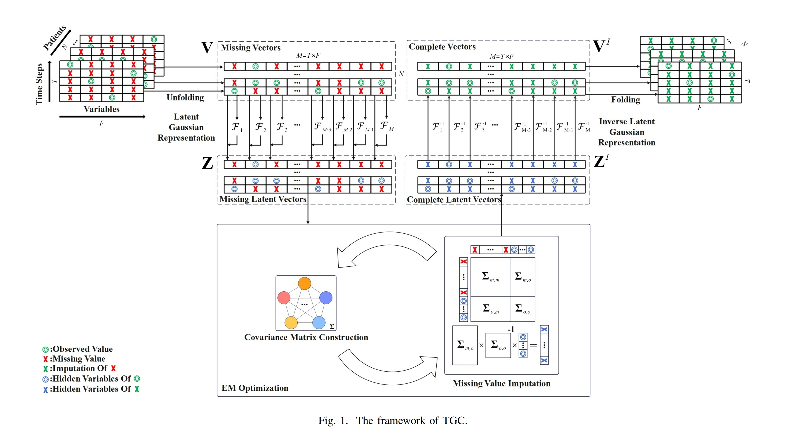

## Temporal Gaussian Copula For Clinical Multivariate Time Series Data Interpolation (BIBM 2024)


 

[](https://badges.pufler.dev/visits/MVL-Lab/SigRL)
 


# Introduction
Multivariate time series (MTS) is particularly valuable in clinical diagnosis and disease surveillance. The imputation of the MTS is particularly applicable and challenging since the MTS typically contains irregular patterns of missing values, due to various factors such as instrument failures, interference from irrelevant data, and privacy regulations. Although existing statistical methods and deep learning methods have shown promising results in time series imputation, they failed to fully exploit the stronger temporal relationships among clinical variables when applied to the MTS. Moreover, they struggle to handle the MTS data variations in sampling density, a very common issue in MTS. To address these challenges, in this paper, we propose a Temporal Gaussian Copula Model (TGC) for three-order MTS imputation. The key idea is to leverage the Gaussian Copula to explore the cross-variable and temporal relationships based on the latent Gaussian representation. 
Subsequently, we employ an Expectation-Maximization (EM) algorithm to enhance the robustness of handling data with varying miss rates.  We finally theoretically prove our proposed TGC is equivalent to the three-order Gaussian Copula. Comprehensive experiments were conducted on three real-world MTS datasets. The results demonstrate that our TGC substantially outperforms the state-of-the-art imputation methods. Additionally, the TGC model exhibits stronger robustness to the varying missing ratios in the test dataset.




## Setup

```bash
pip install -r requirements.txt
```

## Testing on PhysioNet2012

```bash
python3 TGC_PhysioNet2012.py
```

## Acknowledgement

We would like to thank [gcimpute]([udellgroup/gcimpute: Missing value imputation using Gaussian copula](https://github.com/udellgroup/gcimpute)) and [pypots]([WenjieDu/PyPOTS: A Python toolkit/library for reality-centric machine/deep learning and data mining on partially-observed time series, including SOTA neural network models for scientific analysis tasks of imputation/classification/clustering/forecasting/anomaly detection/cleaning on incomplete industrial (irregularly-sampled) multivariate TS with NaN missing values](https://github.com/WenjieDu/PyPOTS)) for the codebase.

We have modified some of the code in the gcimpute package, so we put it in file list.

## Citation

If you find this repo useful, please cite our paper.

```bibtex
@inproceedings{su2024temporal,
  title={Temporal Gaussian Copula For Clinical Multivariate Time Series Data Imputation},
  author={Su, Ye and Qiao, Hezhe and Wu, Di and Chen, Yuwen and Chen, Lin},
  booktitle={2024 IEEE International Conference on Bioinformatics and Biomedicine (BIBM)},
  pages={3717--3721},
  year={2024},
  organization={IEEE}
}
```
